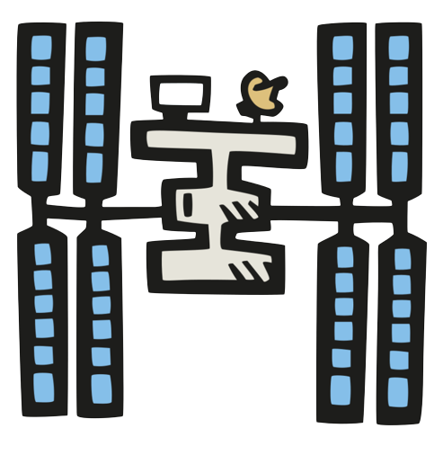
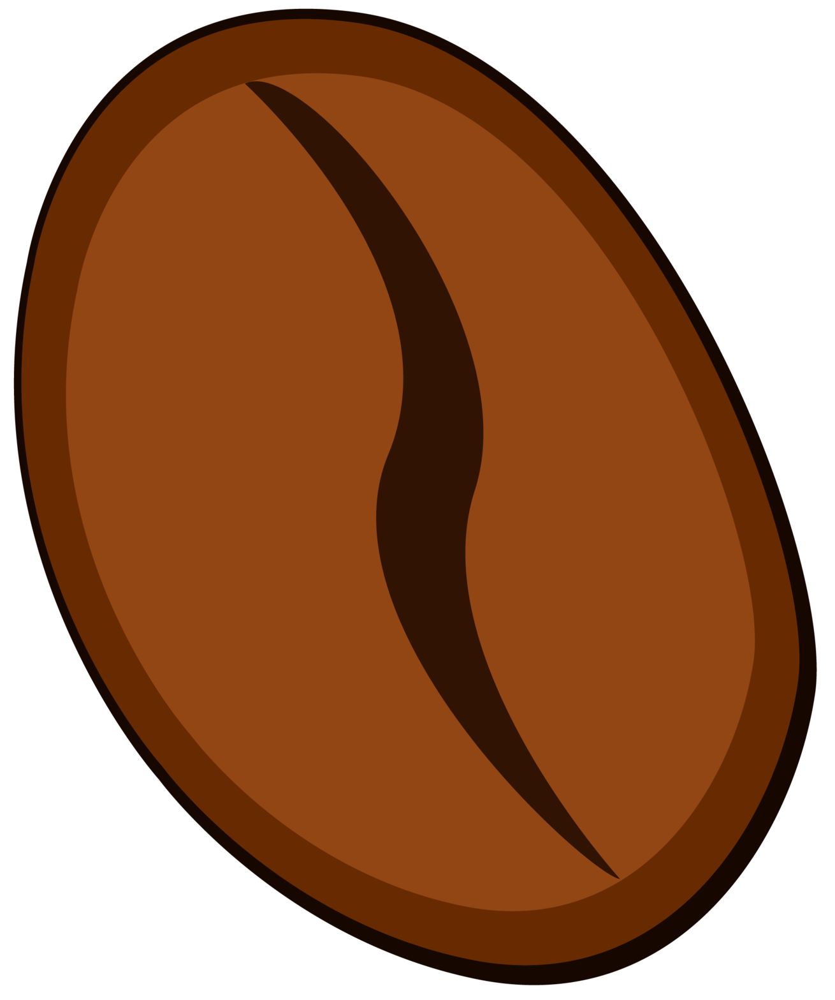
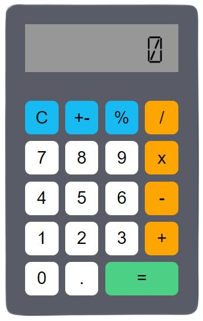
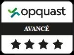

 
# Mes réalisations 
 
      

 
 
[TrackerApp de la Station Spatiale Internationale](https://laurentarcosisstracker.surge.sh/)
 
[Site vitrine Coffee Shop](https://lacoffeedential.surge.sh/)

[Weather App](http://laurentarcosweatherapp.surge.sh/) 

[Trivia Quizz](https://laurentarcostriviaquizz.surge.sh/) 

[TRIBU](https://tribu.surge.sh/)

[Flags of the world](https://laurentarcosflagsoftheworld.surge.sh/)
 
[Calculatrice](https://laurentarcoscalculatrice.surge.sh/)
 
[Mon CV en ligne (en JS avec github pages)](https://laurentarcos.github.io/mon-cv/html/)   

 

#  TRIBU - Projet de fin de formation

### --->  [Voir le site](https://tribu.surge.sh/)  <---

 

Je présente le Front sur  

Le [repository](https://github.com/LaurentArcos/Tribu-Front) du front

 

# 📫 Me contacter :

 

 

      

 

# 🛠 Compétences

 
 
## Certification [Opquast](https://www.opquast.com/)

855 pts obtenus

Maîtrise avancée de la qualité en projet web
[Voir le certificat](https://directory.opquast.com/fr/certificat/SMY4W8/)

 
 
## Les langages et technos

 

## Mes outils

 

## Côté design

 

## Et bientôt...

 

# 👩‍💻 Quelques stats

 
 

